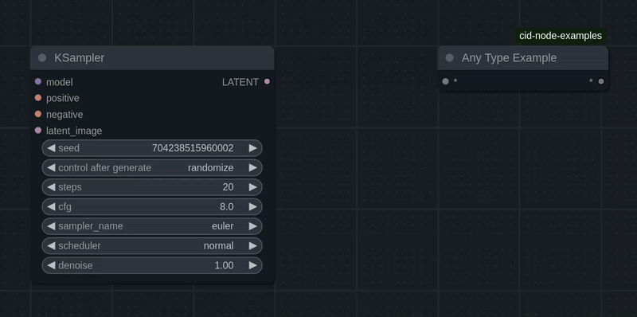
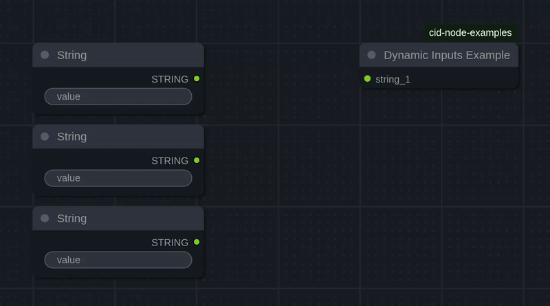

# Node Examples for ComfyUI

These nodes exemplify various techniques in a clear way and can serve as a starting point for other devs looking to create their own custom nodes.

## AnyTypeExample

A node that uses a dynamically typed input/output pair.  
The type is taken from the source and applied to both the input and output.

## DynamicInputsExample

A node that dynamically handles a variable number of input slots.  
Input slots are added as connections are made, and removed when connections are broken.

